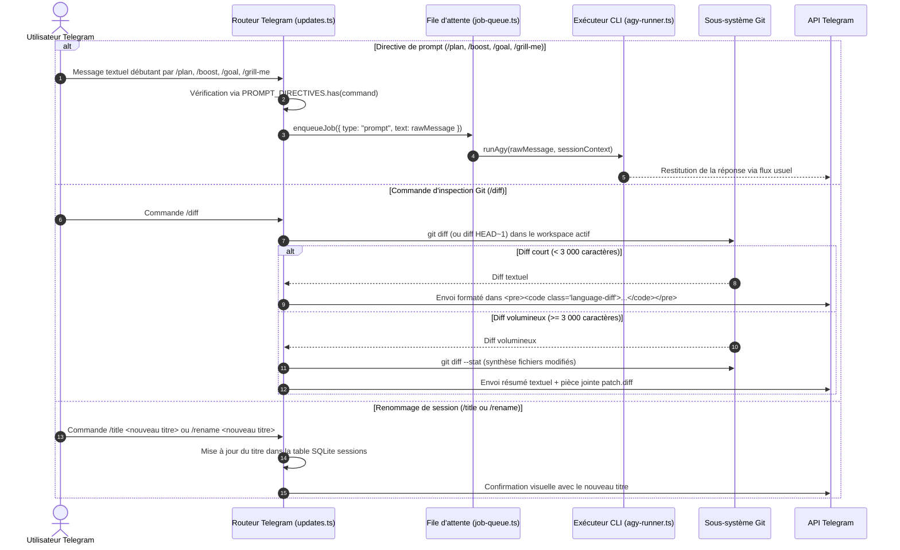

# Spécifications fonctionnelles et techniques : Parité des fonctionnalités AGY CLI et directives de prompt

> **Projet :** agy-telegram  
> **Statut :** Spécification validée (Phase 1 prête pour implémentation)  
> **Date de rédaction :** 18/09/2026  
> **Version cible :** v0.6.0  
> **Issue associée :** [#8](https://github.com/Homeboyz-IT/agy-telegram-private/issues/8)  
> **RFC amont associée :** [#46](https://github.com/ardiannurcahya/antigravity-cli-telegram-bot/issues/46)  

---

## 1. Contexte et Objectifs

### 1.1 Problématique
La passerelle `agy-telegram` interface Telegram avec l'outil officiel Antigravity CLI (`agy`). Cependant, l'évolution récente d'Antigravity CLI (v1.1.27+) a introduit de nouvelles capacités de cadrage cognitif et de gestion de session qui étaient jusqu'ici inaccessibles via Telegram :
1. **Rejet des directives natives de prompt :** Tout message commençant par un slash non reconnu par le routeur Telegram (ex: `/plan`, `/boost`, `/grill-me`, `/goal`) est immédiatement rejeté avec le message `Unknown command. Use /menu.` au lieu d'être acheminé vers le moteur d'exécution AGY.
2. **Absence d'inspection des modifications locales :** L'utilisateur en mobilité ne peut pas visualiser les diffs Git produits par l'agent dans le workspace actif sans recourir à un terminal SSH externe.
3. **Identification des sessions :** Dans le sélecteur `/resume`, les sessions sont uniquement identifiées par leur horodatage et leur premier prompt, rendant difficile la distinction des contextes sans commande explicite de renommage (`/title` ou `/rename`).

### 1.2 Alignement avec la vision du mainteneur amont (@ardiannurcahya)
Suite à la soumission de la RFC amont [#46](https://github.com/ardiannurcahya/antigravity-cli-telegram-bot/issues/46), le mainteneur a formalisé les principes et la feuille de route suivants :
* **Garde-fou architectural strict :** L'ensemble des exécutions doit impérativement continuer de transiter par le binaire officiel Antigravity CLI (`agy`) sans altération des en-têtes de requêtes ni contournement du runtime CLI officiel.
* **Découpage officiel en 3 phases :**
  - **Phase 1 (Impact immédiat / cette spec) :** Passthrough des directives de prompt (`/plan`, `/boost`, `/grill-me`, `/goal`), commande `/diff` adaptative et renommage `/title` (ou `/rename`).
  - **Phase 2 (Écosystème CLI) :** Intégration de `/skills` et `/mcp` aux côtés de `/plugins` et `/agents` dans le menu *CLI & Tools*.
  - **Phase 3 (Cycle de vie de session avancé) :** `/btw`, `/fork`, `/rewind` avec gestion fine d'état dans la base SQLite.

---

## 2. Flux fonctionnel détaillé (Phase 1)



---

## 3. Architecture technique et Contrats d'interface

### 3.1 Passthrough des directives de prompt (`src/router/updates.ts`)
* Remplacement du rejet brutal des slash-commands non reconnues par un ensemble d'autorisation explicite :
  ```typescript
  export const PROMPT_DIRECTIVES = new Set([
    'plan',
    'boost',
    'goal',
    'grill-me',
  ]);
  ```
* Si `PROMPT_DIRECTIVES.has(commandName)`, le message brut complet (y compris les arguments ou le prompt accompagnant la commande) est acheminé directement vers `enqueueJob` comme un prompt ordinaire.
* Si la commande n'est ni une commande interne de passerelle ni une directive autorisée, le message d'aide standard `Unknown command. Use /menu.` reste affiché.

### 3.2 Commande `/diff` (`src/usecases/diff-command.ts`)
* Détection de l'espace de travail actif associé à la session.
* Exécution de `git diff` avec limitation de sortie :
  - **Seuil d'affichage direct :** 3 000 caractères.
  - **Formatage court :** Envoi en Markdown/HTML avec bloc de code `<pre><code class="language-diff">...</code></pre>`.
  - **Formatage long :** Envoi d'un message synthétique avec le résultat de `git diff --stat` (fichiers modifiés, ajouts, suppressions) et envoi simultané d'un document Telegram avec le fichier `changes-<timestamp>.diff`.
  - **Gestion des répertoires non-Git :** Si le workspace n'est pas un dépôt Git, renvoi d'un message explicatif clair : `⚠️ Le workspace actif n'est pas un dépôt Git initialisé.`

### 3.3 Commande `/title` ou `/rename` (`src/usecases/title-command.ts`)
* Syntaxe acceptée : `/title <titre>` ou `/rename <titre>`.
* Mise à jour de la colonne `custom_title` (ou `title`) dans la table `sessions` de SQLite.
* Intégration dans l'affichage de `/resume` : le titre personnalisé prend la priorité sur l'aperçu du premier prompt.

---

## 4. Sécurité, Résilience et Gestion des erreurs

1. **Intégrité du runtime AGY :** Aucune modification de requête HTTP, aucun contournement de l'API Antigravity CLI. Le binaire `agy` gère lui-même l'interprétation des flags et directives de prompt.
2. **Confinement de workspace (`isWithin`) :** La commande `/diff` ne peut s'exécuter que strictement à l'intérieur du répertoire de travail validé de la session active, interdisant toute fuite d'informations hors de l'arborescence autorisée.
3. **Protection contre les fuites de secrets dans `/diff` :** Les fichiers masqués par `.gitignore` ou contenant des motifs sensibles ne doivent pas être divulgués.
4. **Nettoyage des fichiers temporaires :** En cas d'exportation d'un patch `.diff` volumineux, le fichier temporaire généré est purgé immédiatement après l'envoi via l'API Telegram.

---

## 5. Expérience utilisateur et Notifications (Mobile-First)

1. **Rendu concis pour `/diff` :**
   - Si aucune modification : `ℹ️ Aucune modification locale en cours dans le workspace actif.`
   - Si modifications courtes : affichage direct dans un bloc de code propre.
   - Si patch lourd : `📊 3 fichiers modifiés (+45, -12)\n📄 Patch complet joint ci-dessous.`
2. **Confirmation `/title` :**
   - `✅ Titre de la session actualisé : "Refonte de la télémétrie"`
3. **Clarté des directives :**
   - L'envoi de `/plan Créer un script de sauvegarde` lance immédiatement la réflexion de planification de l'agent sans friction ni message d'erreur inutile.

---

## 6. Scénarios de tests et Validation

| Identifiant | Cas testé | Entrée utilisateur | Comportement attendu |
| :--- | :--- | :--- | :--- |
| **TC-PAR-01** | Passthrough `/plan` | `/plan Optimiser la base SQLite` | Message transmis à AGY via `enqueueJob`, pas de message `Unknown command`. |
| **TC-PAR-02** | Passthrough `/boost` | `/boost Corriger le bug de mémoire` | Prise en charge comme prompt prioritaire par l'agent. |
| **TC-PAR-03** | Commande inconnue | `/foobar test` | Message `Unknown command. Use /menu.` affiché. |
| **TC-PAR-04** | Diff Git court | `/diff` (quelques lignes modifiées) | Affichage direct du bloc diff dans le chat Telegram. |
| **TC-PAR-05** | Diff Git volumineux | `/diff` (> 100 lignes) | Envoi du résumé `git diff --stat` et attachement du document `.diff`. |
| **TC-PAR-06** | Diff hors dépôt Git | `/diff` dans un dossier sans Git | Message d'avertissement gracieux `⚠️ Workspace non Git`. |
| **TC-PAR-07** | Renommage `/title` | `/title Migration VPS` | Titre mis à jour en base et visible dans le menu `/resume`. |

---

## 7. Plan d'implémentation par étapes (Phase 1)

1. **Étape 1 : Constante et routeur de directives (`src/router/updates.ts`)**
   - Définition de `PROMPT_DIRECTIVES`.
   - Routage transparent vers `enqueueJob`.
2. **Étape 2 : Commande `/diff` et gestionnaire de pièces jointes**
   - Création de `src/usecases/diff-command.ts`.
   - Intégration de la détection de taille et génération de document temporaire pour Telegram.
3. **Étape 3 : Commande `/title` et stockage SQLite**
   - Ajout de la méthode de mise à jour dans `src/db/sessions.ts`.
   - Branchement de la commande dans le routeur et rafraîchissement du clavier `/resume`.
4. **Étape 4 : Tests automatisés et recette mobile**
   - Rédaction des tests unitaires (`test/prompt-directives.test.ts`, `test/diff-command.test.ts`).
   - Validation sur bot de test dédié.
