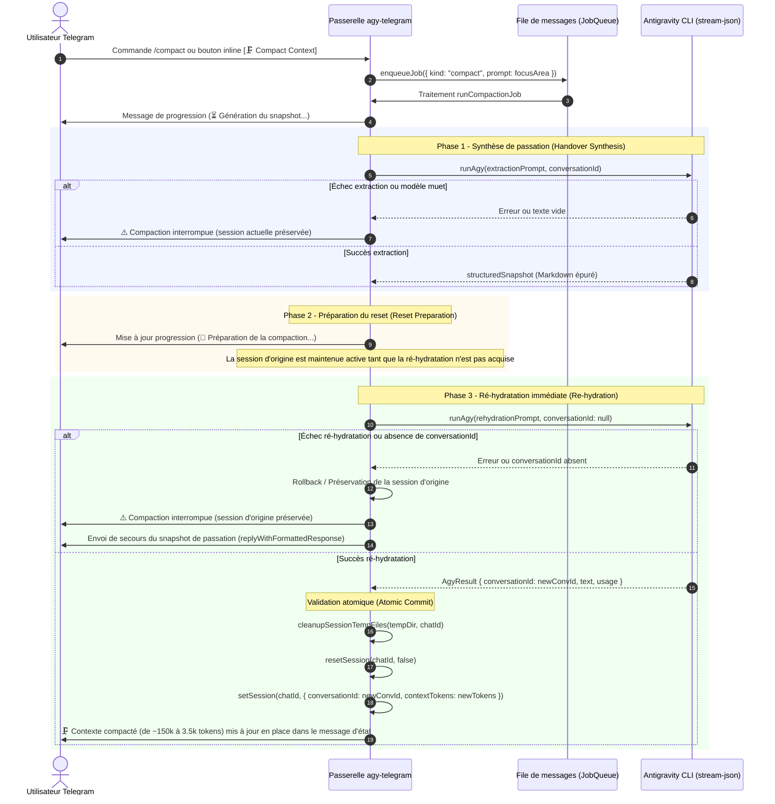

# Spécifications fonctionnelles et techniques : Compaction de contexte orchestrateur et télémétrie dynamique

> **Projet :** agy-telegram  
> **Statut :** Implémenté (en cours de qualification sur le dépôt privé)  
> **Date de rédaction :** 13/09/2026  
> **Version cible :** v0.5.1  
> **Issues associées :** [#39](https://github.com/ardiannurcahya/antigravity-cli-telegram-bot/issues/39), [#40](https://github.com/ardiannurcahya/antigravity-cli-telegram-bot/issues/40)

---

## 1. Contexte et objectifs

### Problématique
1. **Absence de primitive de compaction interne dans `agy` :**
   Le CLI `agy` s'appuie sur un journal de conversation linéaire en ajout seul (`transcript.jsonl`) et ne possède aucune commande interne de troncature ou de compaction (à la différence d'outils comme Claude Code).
2. **Effet pervers du `/compact` initial :**
   La commande `/compact` historique du bot se contentait d'injecter un prompt en langage naturel dans la session active demandant au modèle de « compacter le contexte ». Comme les tours antérieurs demeurent dans le fichier de transcription, cette requête ajoutait un tour de dialogue supplémentaire et augmentait mécaniquement le volume cumulé de jetons.
3. **Saturation et dégradation d'attention (*Lost in the Middle*) :**
   Au fil des sessions de développement longues (sorties d'outils volumineuses, diffs successifs), la saturation du contexte entraîne des pertes d'instructions, des hallucinations et un renchérissement inutile des coûts de requêtes.
4. **Manque de visibilité passive sur mobile :**
   L'utilisateur devait saisir manuellement `/context` pour vérifier la saturation de son contexte, sans bouton d'action direct en 1 clic.

### Solution retenue (Pipeline orchestrateur en 3 temps)
Validée en concertation avec @ardiannurcahya et @HydStAn sur les issues #39 et #40 :
1. **Pipeline natif en 3 phases (`/compact`) :**
   - **Phase 1 (Handover Snapshot Synthesis) :** Extraction ciblée en arrière-plan d'une note structurée (objectifs actifs, fichiers modifiés, décisions clés, prochaines étapes) en éliminant les sorties d'outils et logs résiduels.
   - **Phase 2 (Automated Clean Reset) :** Réinitialisation automatisée propre (`resetSession`) avec remise à zéro du contexte (0 jeton) et purge des fichiers temporaires, tout en préservant intacts les paramètres vitaux de travail (workspace, modèle, effort, mode plan/accept-edits, sandbox).
   - **Phase 3 (Seamless Re-hydration) :** Amorce immédiate de la nouvelle session avec la note de synthèse comme premier message, restaurant l'attention complète du modèle avec plus de 95 % de réduction de bruit.
2. **Télémétrie dynamique des jetons sur les boutons :**
   - Affichage dynamique du volume de contexte (ex. `[ 🧠 142k (14%) ]`) dans le profil Développeur et le sous-menu CLI & Tools.
   - Actualisation passive après chaque réponse de prompt et chaque contrôle `/context`, sans aucun polling réseau.
3. **Boutons inline sous le rapport de contexte :**
   - Clavier d'action sous `/context` : `[ 🗜️ Compact Context ]` | `[ 🔄 Refresh ]`.

---

## 2. Architecture et flux fonctionnel

---

## 3. Détails d'implémentation technique

### 1. Cycle de vie de la note de passation et politique de confidentialité
- **Traitement prioritaire en mémoire vive :** La synthèse transite directement comme chaîne de caractères (`string`) entre la phase 1 et la phase 3.
- **Purge systématique :** La fonction `cleanupSessionTempFiles` est appelée lors du reset, garantissant zéro pollution résiduelle sur disque.
- **Préservation stricte du workspace :** Aucun fichier parasite n'est injecté dans le répertoire de travail utilisateur.

### 2. Télémétrie dynamique et formatage des jetons
- **Fonction `formatTokenCount(tokens)` :**
  - `< 1 000` : valeur brute (ex. `533`)
  - `1 000` à `999 999` : format kilotokens (ex. `4.1k`, `142k`)
  - `≥ 1 000 000` : format mégatokens (ex. `1M`, `1.2M`)
- **Libellé dynamique `contextButtonLabel(session)` :**
  - En présence de métriques : `🧠 142k (14%)` ou `🧠 142k`
  - Sans session active ou après remise à zéro : `🧠 Active Context`
- **Parseur d'extraction `parseContextMetrics(rawOutput)` :**
  - Extraction robuste des jetons actifs et du pourcentage via expressions régulières sur les sorties TUI du CLI `agy`.

### 3. Sécurité d'exécution (*Fail-Safe Abort*)
- Si l'extraction de synthèse échoue (crash du processus, timeout ou réponse vide), la session courante n'est jamais réinitialisée. L'utilisateur reçoit une notification explicite et conserve l'intégralité de son historique actif.

### 4. Ergonomie Telegram et intégrité de la télémétrie
- **Épuration visuelle :** La finalisation de compaction s'effectue exclusivement par édition en place du message d'état initial (`progressMessage`). Aucun message d'accusé LLM séparé n'est envoyé dans le chat, éliminant tout mur de texte superflu.
- **Verrouillage anti-hallucination du prompt de ré-hydratation :** Le prompt interdit expressément au modèle de commenter ou d'estimer verbalement sa taille de contexte, garantissant que la télémétrie affichée par le bot demeure l'unique source de vérité.

---

## 4. Matrice de couverture des tests

| Composant | Fichier de test | Scénarios validés |
| :--- | :--- | :--- |
| Formatage jetons | `test/compaction.test.ts` | Valeurs nulles, 0, petits nombres, k-tokens et M-tokens |
| Libellés claviers | `test/compaction.test.ts` | Adaptation dynamique selon télémétrie et profil Dev |
| Clavier d'action | `test/compaction.test.ts` | Boutons `🗜️ Compact Context` et `🔄 Refresh` |
| Parser de callbacks | `test/callback-parser.test.ts` | Décodage et sérialisation de `action:compact` |
| Détection métriques | `test/pty-runner.test.ts` | Extraction de ratio jetons et pourcentage ANSI |
| Fail-Safe Abort | `test/compaction.test.ts` | Préservation de la session en cas d'échec de synthèse |
| Rollback & secours | `test/compaction.test.ts` | Restauration session et envoi snapshot sur échec ré-hydratation, ID manquant ou annulation |
| Neutralisation drapeaux | `test/compaction.test.ts` | Exclusion de `--continue` / `--new-project` en phase 3 et reset session |
| Pipeline complet | `test/compaction.test.ts` | Enchaînement nominal Snapshot → Reset → Re-hydrate, vérification anti-hallucination et zéro accusé redondant |
