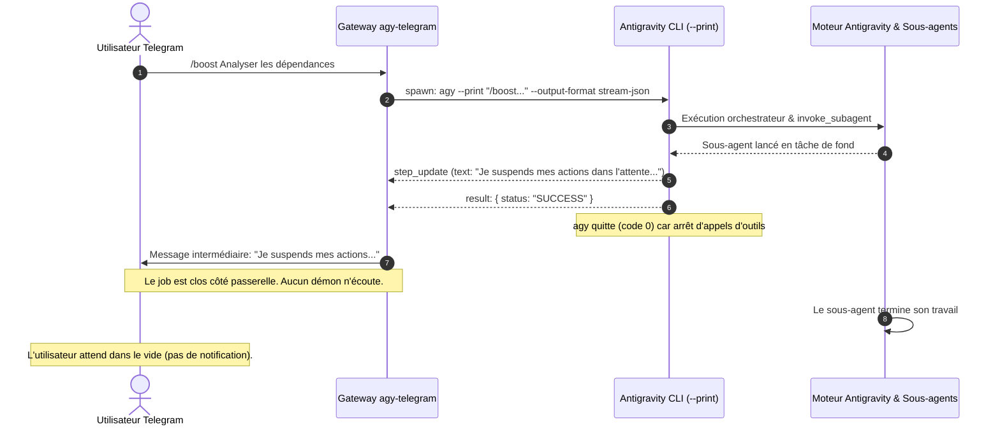
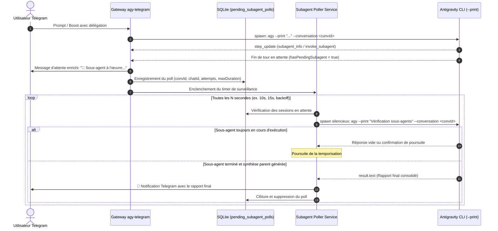
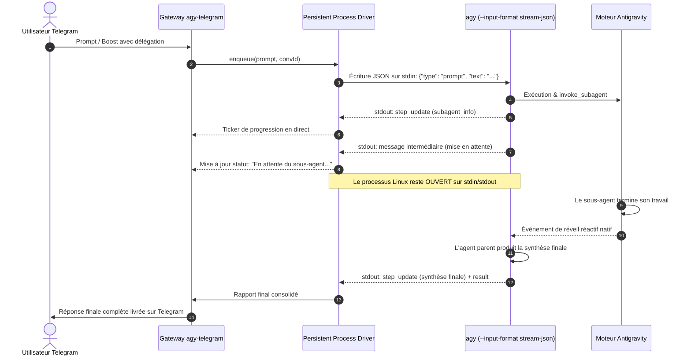

# Spécifications fonctionnelles et techniques : Gestion du cycle de vie asynchrone des sous-agents et auto-notification Telegram

> **Projet :** agy-telegram  
> **Statut :** Spécification en cours de rédaction  
> **Date de rédaction :** 20/09/2026  
> **Version cible :** v0.5.0  
> **Issues associées :** Issue privée [#10](https://github.com/Homeboyz-IT/agy-telegram-private/issues/10) · RFC amont [#49](https://github.com/ardiannurcahya/antigravity-cli-telegram-bot/issues/49)

---

## 1. Contexte et objectifs

### Problématique constatée
Dans le cadre de l'intégration des fonctionnalités avancées d'Antigravity CLI et des tests de recette de la parité (Phase 1, issue #8), une divergence structurelle a été mise en évidence entre l'environnement interactif Desktop/IDE d'Antigravity et le mode sans tête (*headless*, `--print`) exploité par la passerelle Telegram.

Lorsqu'une tâche déclenche la délégation vers un sous-agent via l'outil natif `invoke_subagent` :
1. **Déclenchement de la délégation :** Cette situation se produit soit via une directive explicite (comme `/boost <prompt>` activant le template interne `<ORCHESTRATOR>`), soit par autonomie du modèle (décision spontanée de scinder une tâche complexe en instanciant un sous-agent comme `research` ou `DeepInvestigator`), soit par des règles de projet (*instructions/custom instructions* prescrivant de décharger l'exploration ou les tests).
2. **Suspension du tour parent :** Conformément aux consignes de l'orchestrateur (*"After invoking subagents, stop and wait for their responses before doing anything else"*), l'agent parent formule un message textuel intermédiaire d'attente (ex. *"L'investigation par le sous-agent DeepInvestigator a été lancée... Je suspends mes actions dans l'attente de son analyse..."*) et cesse d'appeler des outils.
3. **Clôture prématurée du processus :** En mode `agy --print --output-format stream-json`, la cessation des appels d'outils par le modèle est interprétée par le CLI comme la fin du tour d'exécution. Le CLI émet immédiatement l'événement `{ event: "result", result: { status: "SUCCESS" } }` et le sous-processus Linux `agy` s'arrête avec le code 0.
4. **Rupture de la boucle d'événements :** La passerelle `agy-telegram` transmet ce message intermédiaire d'attente à l'utilisateur sur Telegram et marque le job comme terminé dans sa file d'attente.
5. **Attente infinie côté utilisateur :** Même si le sous-agent continue ou finalise son analyse au sein du moteur Antigravity, aucun démon ni écouteur ne subsiste côté passerelle pour intercepter la fin du sous-agent, réinjecter son résultat auprès du parent et pousser spontanément la synthèse finale sur Telegram. L'utilisateur doit relancer manuellement l'agent (ex. `/resume` ou nouveau message) pour espérer obtenir le résultat.

### Élargissement du périmètre (retour d'arbitrage)
Initialement circonscrite au comportement sous `/boost`, l'étude technique a été officiellement élargie à **l'ensemble des délégations via `invoke_subagent`** suite à la soumission de la RFC amont [#49](https://github.com/ardiannurcahya/antigravity-cli-telegram-bot/issues/49). Le mécanisme doit donc être agnostique du mode de déclenchement (autonomie du LLM, directives de prompt ou règles projet).

### Objectifs généraux
1. **Délivrance autonome du rapport consolidé :** Garantir que dès l'achèvement du sous-agent, la synthèse finale produite par l'agent parent soit transmise spontanément à l'utilisateur sur Telegram sans aucune relance manuelle.
2. **Information en temps réel de l'utilisateur :** Notifier clairement l'utilisateur que l'opération se poursuit en tâche de fond avec le rôle du sous-agent concerné.
3. **Trajectoire technique en deux temps :**
   - **Phase 1 (Court/moyen terme - Passerelle) :** Mécanisme d'Auto-polling et de réveil automatique orchestré par la passerelle dans le cadre de l'architecture actuelle *spawn-per-turn*.
   - **Phase 2 (Cible long terme - Moteur) :** Driver persistant bidirectionnel via `--input-format stream-json`, aligné avec la Phase 3 de la parité CLI.

---

## 2. Flux fonctionnels détaillés

### 2.1 Constat d'échec actuel (Rupture du cycle asynchrone)



### 2.2 Solution Phase 1 : Auto-polling et réveil par la passerelle (Court terme)



### 2.3 Solution Phase 2 : Driver persistant bidirectionnel (Cible Phase 3)



---

## 3. Modèle de données et contrats d'interface

### 3.1 Détection d'état sous-agent dans le parseur de flux (`src/agy-runner.ts`)

Extension du modèle de retour `AgyResult` pour qualifier précisément l'état de terminaison du tour :

```typescript
export interface SubagentPendingState {
  hasInvokedSubagent: boolean;
  subagentName?: string | null;
  subagentRole?: string | null;
  isWaitingTurn: boolean;
}

export interface AgyResult {
  text: string;
  intermediateText?: string | null;
  parsed: StreamEvent | Record<string, unknown> | null;
  events: StreamEvent[];
  conversationId: string | null;
  model: string | null;
  usage: Usage | null;
  durationMs: number | null;
  numTurns: number | null;
  toolCalls: number;
  status: string | null;
  activeInputTokens?: number | null;
  // Nouveau champ de qualification du cycle de sous-agents
  subagentState?: SubagentPendingState;
}
```

#### Critères de qualification de `isWaitingTurn` :
Un tour est qualifié d'`isWaitingTurn` si :
1. Un événement `subagent_info` ou un appel d'outil `invoke_subagent` a été émis lors de la session.
2. Le dernier message émis par le parent exprime une mise en attente (mots-clés / motifs caractéristiques : *"wait"*, *"suspends"*, *"attente"*, *"subagent launched"*, *"en cours"*).
3. Aucun tour de synthèse subséquent n'a été produit avant l'événement `result`.

### 3.2 Schéma de persistance SQLite (`src/db.ts`)

Pour garantir la résilience en cas de redémarrage de la passerelle (`systemd restart agy-telegram`), l'état des surveillances en cours est stocké en base :

```sql
CREATE TABLE IF NOT EXISTS pending_subagent_polls (
  id INTEGER PRIMARY KEY AUTOINCREMENT,
  conversation_id TEXT NOT NULL,
  chat_id TEXT NOT NULL,
  message_thread_id INTEGER,
  progress_message_id INTEGER,
  subagent_role TEXT,
  started_at INTEGER NOT NULL,
  last_poll_at INTEGER NOT NULL,
  poll_attempts INTEGER DEFAULT 0,
  max_attempts INTEGER DEFAULT 30,
  poll_interval_sec INTEGER DEFAULT 15,
  status TEXT CHECK(status IN ('polling', 'completed', 'timeout', 'failed')) DEFAULT 'polling',
  created_at TIMESTAMP DEFAULT CURRENT_TIMESTAMP
);

CREATE INDEX IF NOT EXISTS idx_pending_polls_status ON pending_subagent_polls(status);
```

### 3.3 Configuration applicative (`src/config.ts`)

```typescript
export interface SubagentPollingConfig {
  enabled: boolean;             // Activer l'auto-polling (défaut: true)
  initialDelaySec: number;      // Délai avant la première vérification (défaut: 10s)
  pollIntervalSec: number;      // Intervalle entre vérifications (défaut: 15s)
  maxDurationSec: number;       // Durée maximale de surveillance (défaut: 300s / 5min)
  silentProbePrompt: string;    // Prompt de réveil injecté (défaut: "Vérifier la réponse du sous-agent et formuler la synthèse")
}
```

---

## 4. Sécurité, résilience et gestion des erreurs

### 4.1 Prévention des boucles infinies et des surcoûts d'API
- **Plafond temporel strict (*hard timeout*) :** La durée totale de surveillance d'un sous-agent ne peut excéder `maxDurationSec` (par défaut 5 minutes). Passé ce délai, le poll est marqué `timeout`, une notification est envoyée à l'utilisateur et le minuteur est détruit.
- **Backoff modéré :** L'intervalle de polling augmente progressivement (10s, 15s, 20s, 30s) pour ne pas saturer le sous-système de processus ni consommer inutilement de tokens si l'investigation est lourde.
- **Nettoyage automatique :** À la réception du résultat final, l'entrée en base est marquée `completed` et purgée.

### 4.2 Résilience aux redémarrages (Crash recovery)
- Au démarrage du service `agy-telegram`, une routine scanne `pending_subagent_polls` pour les entrées `status = 'polling'`.
- Si le délai `maxDurationSec` est écoulé depuis `started_at`, l'entrée passe à `timeout` et prévient l'utilisateur.
- Sinon, le timer de surveillance est immédiatement réarmé pour reprendre le fil de l'exécution.

### 4.3 Protection des données (Privacy by Design)
- La table `pending_subagent_polls` ne consigne aucun texte de prompt confidentiel, aucun jeton de modèle ni aucune donnée descriptive : seuls les identifiants techniques opaques (`conversationId`, `chatId`, `progressMessageId`) sont persistés.

---

## 5. Expérience utilisateur et notifications Telegram

### 5.1 Notification d'engagement du sous-agent
Dès la détection de la mise en attente, le message de progression ou un message dédié informe l'utilisateur :

```
🤖 <b>Délégation en cours</b> (DeepInvestigator)
<i>L'analyse se poursuit en tâche de fond. Le compte-rendu final sera automatiquement délivré ici dès finalisation.</i>
```

### 5.2 Notification du résultat final
Dès que la sonde détecte l'achèvement et que le parent produit la synthèse :
1. Le message temporaire de mise en attente est mis à jour ou clôturé.
2. La synthèse complète est délivrée dans le fil ou topic approprié avec le formatage Markdown habituel et la télémétrie post-prompt.

### 5.3 Notification en cas de timeout
Si le sous-agent dépasse le temps limite alloué :
```
⏱️ <b>Délai d'analyse dépassé pour le sous-agent</b> (5 min)
L'analyse en arrière-plan prend plus de temps que prévu. Vous pouvez interroger l'état ou relancer la session manuellement avec <code>/resume</code>.
```

---

## 6. Scénarios de tests et validation

| Identifiant | Scénario testé | Données d'entrée | Résultat attendu |
|---|---|---|---|
| **TC-01** | Délégation explicite `/boost` | `/boost Analyser les dépendances npm` | Détection `subagent_info`, notification d'attente, déclenchement du poll, livraison finale sans action manuelle. |
| **TC-02** | Délégation autonome du modèle | Prompt complexe incitant à `invoke_subagent` (sans `/boost`) | Qualification automatique en `isWaitingTurn`, enregistrement en base, délivrance automatique du rapport. |
| **TC-03** | Dépassement du temps limite (Timeout) | Sous-agent bloqué ou simulation de tâche > 5 min | Arrêt de la boucle de sondes à 5 min, notification de timeout, libération des verrous de session. |
| **TC-04** | Redémarrage du bot en cours d'attente | `systemctl --user restart agy-telegram` pendant le poll | Reprise transparente de la surveillance au démarrage, délivrance de la réponse dès dispo. |
| **TC-05** | Exécution directe sans sous-agent (nominal) | Prompt standard exécuté en Solo Routine | `subagentState.hasInvokedSubagent = false`, flux instantané standard sans déclenchement de polling. |

---

## 7. Plan d'implémentation par étapes

### Étape 1 : Qualification et métriques de sous-agent (`src/agy-runner.ts`)
- Détecter et consigner les événements de délégation (`subagent_info`, appel d'outil `invoke_subagent`).
- Détecter l'état de suspension du tour et exposer `subagentState` dans `AgyResult`.

### Étape 2 : Persistance et modèle SQLite (`src/db.ts`)
- Créer la table `pending_subagent_polls` et les fonctions d'accès CRUD (`insertPendingPoll`, `getActivePolls`, `updatePollStatus`, `deletePoll`).

### Étape 3 : Gestionnaire de polling (`src/usecases/subagent-poller.ts`)
- Implémenter le service de réveil asynchrone avec gestion des temporisations, exécution de sondes silencieuses sur `--conversation <id>` et reprise sur incident.

### Étape 4 : Intégration dans `src/usecases/prompt-job.ts` et UX Telegram
- Brancher la détection en fin d'exécution de `runAgy`.
- Rendre le comportement transparent pour l'utilisateur avec mise à jour du statut Telegram.

### Étape 5 : Qualification sur bot de test dédié
- Valider la chaîne complète avec le skill `telegram-test-runner` sur le bot de test `8797558243`.

### Étape 6 : Préparation de la transition Phase 2 (Driver persistant)
- Évaluer les retours de la RFC upstream #49 pour aligner le driver persistant `--input-format stream-json` avec les travaux de la Phase 3 de la parité CLI.
