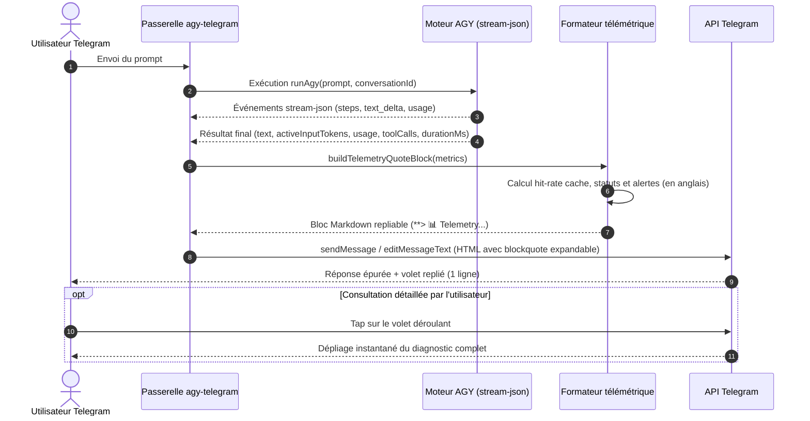

# Spécifications fonctionnelles et techniques : Rationalisation de la télémétrie post-prompt et volet déroulant mobile

> **Projet :** agy-telegram  
> **Statut :** Validé, fusionné dans upstream/main (PR #50) et déployé en production  
> **Date de rédaction :** 17/09/2026 (Actualisé le 23/09/2026)  
> **Version cible :** v0.6.1  
> **Issue associée :** [#9 (privée)](https://github.com/Homeboyz-IT/agy-telegram-private/issues/9) · [RFC upstream #47](https://github.com/ardiannurcahya/antigravity-cli-telegram-bot/issues/47)  
> **Pull Request amont :** [#50](https://github.com/ardiannurcahya/antigravity-cli-telegram-bot/pull/50) (Fusionnée dans `upstream/main`)  

---

## 1. Contexte et objectifs

### Problématique actuelle
1. **Hermétisme de la télémétrie en pictogrammes bruts :**
   L'alignement d'icônes et de pastilles colorées (`⚡ 1.4s · 🧠 🟢 45k (5%) · 💾 🟢 92% · 💭 🟢 1.2k · 🛠️ 🟡 0 · 📤 🟢 280`) sans intitulé explicite est incompréhensible sur smartphone. L'utilisateur doit deviner la signification de chaque chiffre et ne dispose d'aucune explication contextuelle sur la signification des alertes.
2. **Impossibilité de colorer le texte brut sur Telegram :**
   L'API Telegram Bot n'autorise aucune balise de couleur arbitraire (`<font color>` ou styles CSS). Les codes ANSI ne sont pas supportés de manière fiable par les clients mobiles (iOS/Android) et les blocs `diff` forcent l'usage d'un bloc de code multiligne lourd.
3. **Vérité terrain de l'Active Context :**
   Le calcul naïf issu des métriques stream-json cumulées (`input_tokens + cache_read_tokens`) surestimait le contexte réel. La vérité terrain doit s'appuyer sur les tokens d'entrée du dernier pas LLM (`activeInputTokens` issu du stream-json, aligné avec la sonde PTY `/context`).
4. **Vigilance sur les réponses purement conceptuelles :**
   Lorsqu'un agent répond sans exécuter d'outil (`toolCalls === 0`), l'utilisateur doit être averti immédiatement que la réponse est purement théorique et n'a pas fait l'objet d'une vérification sur le système de fichiers ou via le terminal du serveur.

### Objectifs cibles
1. **Affichage repliable natif (`<blockquote expandable>`) :** Encapsuler la télémétrie détaillée dans une citation dépliable en fin de réponse via la syntaxe Markdown `**>`, ne laissant apparaître qu'une unique ligne compacte par défaut.
2. **Langue anglaise intégrale pour la télémétrie :** Tous les libellés, statuts, diagnostics et avertissements de la télémétrie opérationnelle sont rédigés en anglais technique concis (`Active context`, `Prompt cache`, `Thinking tokens`, `Tool calls`, `Response size`, etc.).
3. **Aperçu replié informatif avec alerte visuelle :** La première ligne visible du volet résume l'essentiel (`📊 Telemetry: 45k tokens (5%) · 0 tools ⚠️ · 1.4s`) et signale instantanément toute anomalie sans nécessiter de déplier le volet.
4. **Zéro pollution cognitive :** La réponse textuelle de l'agent reste totalement épurée, préservant la fluidité de lecture sur mobile tout en offrant un diagnostic approfondi en un tap.

---

## 2. Flux fonctionnel détaillé



---

## 3. Modèle de données et contrats d'interface

### Structure des métriques (`src/domain/telemetry.ts`)

```typescript
export interface TelemetryData {
  activeTokens: number | null;
  maxTokens: number;
  inputTokens?: number;
  cacheReadTokens?: number;
  thinkingTokens?: number;
  outputTokens?: number;
  toolCalls: number;
  durationMs?: number | null;
  model: string;
}

export type HealthStatus = "nominal" | "vigilance" | "alert";

export interface MetricDiagnostic {
  label: string;
  value: string;
  status: HealthStatus;
  comment: string;
  hasWarning?: boolean;
}
```

### Grille décisionnelle des seuils et diagnostics (en anglais)

| Métrique | Icône | Nominal | Vigilance | Alert | Diagnostic textuel (Anglais) |
| :--- | :---: | :--- | :--- | :--- | :--- |
| **Active context** | 🧠 | `< 40 %` | `40 % à 70 %` | `> 70 %` | • `< 40%` : `Nominal`<br>• `40-70%` : `Vigilance (consider compaction or archiving)`<br>• `> 70%` : `Alert (run /compact or /new)` |
| **Prompt cache** | 💾 | `> 80 %` | `30 % à 80 %` | `< 30 %` ou `0 %` | • `> 80%` : `Warm cache (optimal)`<br>• `30-80%` : `Moderate hit rate`<br>• `< 30%` : `Cold cache / cache miss` |
| **Thinking tokens** | 💭 | `500 à 2 500` | `< 500` ou `2.5k à 4k` | `> 4 000` | • `500-2.5k` : `Balanced reasoning`<br>• `< 500` : `Fast / minimal reasoning`<br>• `2.5k-4k` : `Deep reasoning`<br>• `> 4k` : `Extended reasoning (check prompt ambiguity)` |
| **Tool calls** | 🛠️ | `1 à 4` | `0` ou `5 à 10` | `> 10` | • `1-4` : `Nominal (verified on server)`<br>• `0` : `0 executions ⚠️ — Conceptual answer (no files or commands checked on server)`<br>• `5-10` : `High tool activity`<br>• `> 10` : `Heavy tool chain (verify loop)` |
| **Response size** | 📤 | `< 600` | `600 à 1 200` | `> 1 200` | • `< 600` : `Concise output`<br>• `600-1.2k` : `Detailed output`<br>• `> 1.2k` : `Verbose output (consider asking for summary)` |

---

## 4. Expérience utilisateur et formatage Telegram

### 4.1 Rendu replié (par défaut sur smartphone)

Le volet apparaît sous forme d'une unique ligne sobre et informative tout en fin de message :

```text
**> 📊 Telemetry: 45k ctx (5%) · 0 tools ⚠️ · 1.4s
```

*Si aucune alerte n'est levée (outils > 0 et contexte sain) :*
```text
**> 📊 Telemetry: 45k ctx (5%) · 2 tools · 1.4s
```

### 4.2 Rendu déplié (après tap de l'utilisateur)

La citation se déplie pour afficher la grille d'évaluation complète :

```text
**> 📊 Operational telemetry:**
**> • Active context:** 45,120 / 1,000,000 tokens (5%) — Nominal
**> • Prompt cache:** 92% hit rate — Warm cache (optimal)
**> • Thinking tokens:** 1,240 tokens — Balanced reasoning
**> • Tool calls:** 0 executions ⚠️ — Conceptual answer (no files or commands checked on server)
**> • Response size:** 280 tokens — Concise output
**> • Model & duration:** Gemini 3.8 Flash · 1.4s
```

---

## 5. Sécurité, résilience et gestion des erreurs

1. **Confidentialité et Zero-Knowledge :** Le bloc télémétrique ne divulgue aucun chemin absolu de fichier, nom de variable ou contenu sensible. Il ne contient que des compteurs numériques et des libellés fonctionnels.
2. **Repli gracieux en cas de métriques incomplètes :** Si AGY ne fournit pas certaines valeurs (ex. `thinking_tokens` sur un modèle standard ou `cache_read_tokens` indisponible), la ligne correspondante affiche `N/A` ou est masquée sobrement sans provoquer d'erreur.
3. **Plafond de taille Telegram (4 096 caractères) :** Le bloc de télémétrie représente environ 350 caractères. La routine d'envoi vérifie que l'ajout du bloc ne provoque pas de dépassement de la limite de taille d'un message Telegram, ou s'insère dans le dernier fragment en cas de découpage multiparts.
4. **Indépendance vis-à-vis de la sonde PTY :** L'Active Context affiché dans la réponse repose sur les `activeInputTokens` immédiatement disponibles en fin de stream-json (dernier tour LLM). La sonde PTY post-prompt `/context` continue de s'exécuter en tâche de fond pour mettre à jour la base SQLite et rafraîchir le bouton du clavier principal (`[ 🧠 45k (5%) ]`).

---

## 6. Scénarios de tests et validation

| Identifiant | Cas testé | Métriques en entrée | Comportement et rendu attendu |
| :--- | :--- | :--- | :--- |
| **TC-TEL-01** | Tour nominal équilibré | 45k tokens (5%), cache 90%, 2 outils, 1.2k thinking, 300 output | Volet replié : `📊 Telemetry: 45k ctx (5%) · 2 tools · 1.2s`. Déplié : tous indicateurs `Nominal` ou `Warm cache`. |
| **TC-TEL-02** | Alerte 0 outil exécuté | Prompt d'architecture sans outil, 0 toolCalls | Volet replié : `0 tools ⚠️`. Déplié : `0 executions ⚠️ — Conceptual answer (no files or commands checked on server)`. |
| **TC-TEL-03** | Contexte saturé (> 70%) | Active context à 780k / 1M (78%) | Volet replié : `780k ctx (78%) ⚠️`. Déplié : `Alert (run /compact or /new)`. |
| **TC-TEL-04** | Cache miss / démarrage à froid | Cache read 0%, Input 20k | Déplié : `Prompt cache: 0% hit rate — Cold cache / cache miss`. |
| **TC-TEL-05** | Modèle sans thinking tokens | Usage sans clé `thinking_tokens` | La ligne thinking affiche `0 tokens — Minimal / fast reasoning` ou `N/A`. Pas d'erreur d'exécution. |

---

## 7. Plan d'implémentation par étapes

1. **Étape 1 : Création du module de télémétrie (`src/domain/telemetry.ts`)**
   - Implémentation de la fonction pure `buildTelemetryQuoteBlock(data: TelemetryData): string`.
   - Calcul du taux de hit du cache : `cacheReadTokens / (inputTokens + cacheReadTokens) * 100`.
   - Évaluation des seuils et génération du formatage Markdown `**>`.
2. **Étape 2 : Intégration dans le flux d'exécution (`src/usecases/prompt-job.ts`)**
   - Extraction des données de télémétrie depuis `result` (`activeInputTokens`, `usage`, `toolCalls`, `durationMs`).
   - Concaténation du bloc repliable en fin de réponse `formattedText`.
3. **Étape 3 : Tests unitaires (`test/telemetry.test.ts`)**
   - Validation de la conformité du format Markdown `**>`.
   - Validation des 5 scénarios de tests (TC-TEL-01 à TC-TEL-05).
   - Contrôle de la conversion en `<blockquote expandable>` via le parseur Markdown existant.
4. **Étape 4 : Qualification et validation mobile**
   - Test en conditions réelles sur bot de test et vérification du comportement tactile sur mobile.

---

## 8. Bilan d'implémentation et ajustements d'architecture

Le développement et la qualification de la télémétrie post-prompt ont été validés le 23/09/2026 avec les arbitrages techniques suivants :

1. **Mode de livraison dédié (`TELEMETRY_POST_PROMPT=message`) :**
   Plutôt que de concaténer le bloc de télémétrie en pied de la réponse textuelle du LLM (ce qui pouvait interférer avec les réponses longues fragmentées en plusieurs messages ou les blocs de code volumineux), la télémétrie est émise dans une bulle dédiée distincte (mise à jour du message de progression ou nouveau message repliable).
   Le paramètre `TELEMETRY_POST_PROMPT` permet les modes : `message` (défaut), `inline` (pied de réponse), `progress` (texte brut historique) et `off`.

2. **Structure explicite en deux volets (*This turn* vs *Session totals*) :**
   - `⏱️ This turn` : Métriques propres à l'exécution courante (`Context growth`, `Thinking tokens`, `Tool calls`, `Response size`, `Model & duration`).
   - `📊 Session totals` : Métriques cumulées sur l'ensemble de la conversation (`Active context`, `Prompt cache`, `Cumulative usage`, `Session duration`).

3. **Accroissement net de contexte (`Context growth`) :**
   Distinction claire entre la croissance nette apportée par le prompt courant (`+X tokens (feeds active context)`) et la taille totale de la fenêtre mémoire active (`Active context`).

4. **Isolation de la durée réelle du run :**
   Mesure locale du temps de traitement du run instantané (`durationMs`) afin de ne pas afficher la durée cumulée de session (`sessionDurationMs`) issue de `usage.duration_ms` de stream-json dans le titre du run.

5. **Validation et couverture :**
   16 tests unitaires dédiés à la télémétrie (`test/telemetry.test.ts`), suite complète de 213 tests au vert (`npm test`), et validation interactive sur le bot de test éphémère (`@Chromie_lemed_test_bot`).
